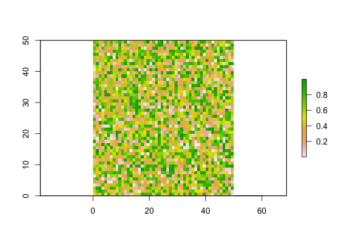
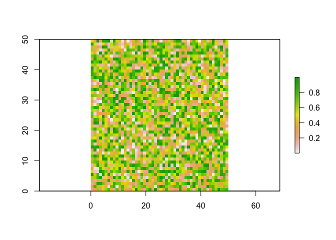
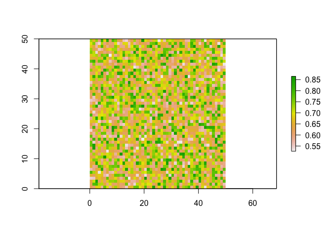

# simulation
Luke

## Simulation

Load packages

``` r
library(tidyverse)
library(raster)
library(virtualspecies)
```

generate random rasters

``` r
f1 = raster(ncol=50, nrow=50, xmn=0, xmx=50, ymn=0, ymx=50)
f2 = raster(ncol=50, nrow=50, xmn=0, xmx=50, ymn=0, ymx=50)

values(f1) = runif(ncell(f1))
values(f2) = runif(ncell(f2))

# stack them
stackf = stack(f1,f2)

plot(f1);plot(f2)
```





Write functions

``` r
inv_logit = function(x) exp(x)/ (1+exp(x))

#Occurencepred = function(x, y, alpha, beta1, beta2, beta12) {
#  
#  ly = alpha +  x * beta1 +  y * beta2 + x * y * beta12
#  y = inv_logit(ly)
#  return(y)
#}

Occurencepred2 <- function(x, y, alpha, beta1, beta2, beta12) {
  nested = function(x, y) inv_logit( alpha +  x * beta1 +  y * beta2 + x * y * beta12)

}

# Apply the function across layers
ypred = overlay(x=stackf[[1]],y=stackf[[2]] ,fun = Occurencepred2(alpha=0.1,beta1=0.5,beta2=0.3,beta12=1))

plot(ypred)
```


