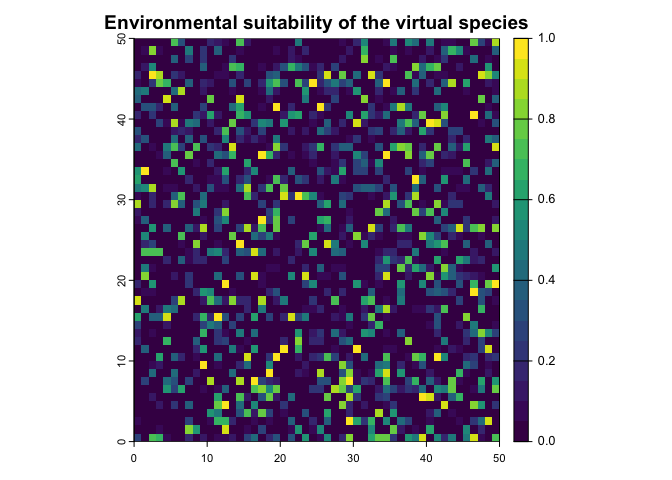

# virtual_species_sim
Luke

## Virtual species

``` r
library(virtualspecies)
```

    Loading required package: terra

    terra 1.7.71

``` r
library(raster)
```

    Loading required package: sp

``` r
# 
f1 = raster(ncol=50, nrow=50, xmn=0, xmx=50, ymn=0, ymx=50)
f2 = raster(ncol=50, nrow=50, xmn=0, xmx=50, ymn=0, ymx=50)

values(f1) = runif(ncell(f1))
values(f2) = runif(ncell(f2))

stackf = stack(f1,f2)

names(stackf) = c("f1","f2")
```

``` r
my.parameters = formatFunctions(f1 = c(fun = 'dnorm', mean = 0, sd = 0.2),
                                f2 = c(fun = 'quadraticFun', a = -1, b = 2, c = 0))

my.first.species = generateSpFromFun(raster.stack = stackf,
                                              parameters = my.parameters,
                                              plot = TRUE)
```

    Generating virtual species environmental suitability...

     - The response to each variable was rescaled between 0 and 1. To
                disable, set argument rescale.each.response = FALSE

     - The final environmental suitability was rescaled between 0 and 1. To disable, set argument rescale = FALSE


